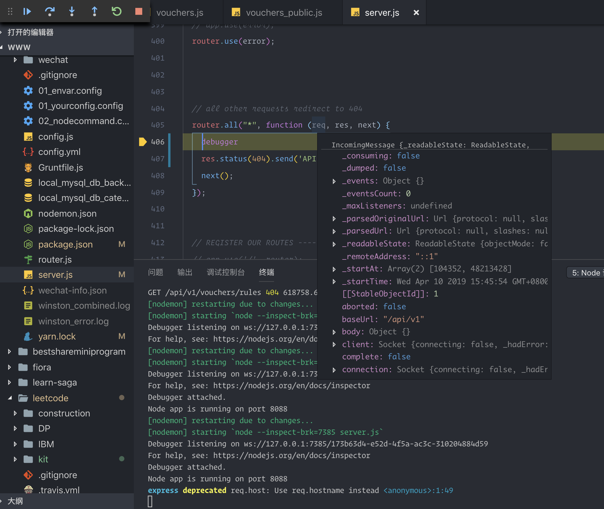

[](https://travis-ci.org/pengliheng/pengliheng.github.io)
[](https://github.com/pengliheng/pengliheng.github.io)
[](http://nodejs.org/download)
[](https://github.com/pengliheng/pengliheng.github.io)
[](https://github.com/pengliheng/pengliheng.github.io)

### 欢迎光临我的博客

###### [本站](https://pipk.top)托管于 Github，所有数据来源于[ISSUE](https://github.com/pengliheng/pengliheng.github.io/issues)，通过 GitHub API v4 动态加载数据渲染页面。

### 我的技术栈

- JavaScript(React Vue)
- Node
- HTTP(http1.1 https http2)
- RegExp
- Nginx
- Python
- Graphql

### TODO

- [x] 引入 jest 单元测试,覆盖率 > 50%
  - reducer 测试
  - component 测试
  - container 测试
- [x] `redux-saga` 替代 `redux-thunk`
- [ ] 将所有组件转化成 `useState` 函数式组件
- [ ] 引入 `typescript`, 因为`react`源码全部由 `typescript` 重写了, 这样组件自带签名,无缝对接`react`源码? 类型监控<any>?

### redux-thunk

使用`redux-thunk`原因在于下面报错内容,允许 action 返回一个函数.

```bash
Uncaught Error: Actions must be plain objects. Use custom middleware for async actions.
```

### docker 构建项目

```bash
./build.sh # 用于构建image,镜像内部运行`yarn build`,构建的dist文件在镜像内部
./run.sh   # 用于运行镜像 `CMD serve -s dist` 运行服务
```

### React 开发原则

尽可能使用 PureComponent,增强性能...
尽可能细化组件.

### React Router

- `<Link />`: 普通链接
- `<NavLink />`: 带 toggleClass 的链接
- `<Prompt />`: 满足条件的时候提示用户是否离开页面
- `<Redirect />`: 重定向
- `<Route />`: 路由匹配核心,匹配则显示的组件
- `<Switch />`: 只匹配第一个路由
- `exact`, 默认匹配的一个路由

### NodeJs debug

`launch.json` file to set debug config

```js
{
    "type": "node",
    "request": "launch",
    "name": "nodemon",                                        // 利用nodemon进行自动重启+debug
    "runtimeExecutable": "nodemon",                           // 运行过程中 可执行文件
    "cwd": "${workspaceFolder}/bestshareapi",                 // 项目根目录
    "program": "${workspaceFolder}/bestshareapi/server.js",   // 启动文件位置
    "restart": true,                                          // 自动重启
    "console": "integratedTerminal",                          // console.log 控制台信息出现在终端
    "internalConsoleOptions": "neverOpen"
},
```



#### quickSort 最简单手写方式 ES6 版本

| 复杂度 |   最少   | 最多 |
| :----: | :------: | :--: |
|  空间  |  log2n   | n-1  |
|  时间  | O(nlogn) | O(n) |

```js
cosnt qk = arr => {
    if (!arr.length) return []
    const [point, ...right] = arr
    return [
        ...qk(arr.filter(item=>item<point)),
        point,
        ...qk(arr.filter(item=>item>point))
    ]
}
```

### Jsx => js

```jsx
<p>{child1}{child2}<p>
React.createElement(标签名/自定义组件变量, props, child1, child2)
```

### `react`组件两种写法

```jsx
// 推荐的写法
// 自动在 shouldcomponentupdate 优化
// 组件是函数
function list({ list }) {
  return list.map(item => <li>{item}</li>)
}
// 不推荐的写法
// 需要手动在 shouldcomponentupdate 中优化
// 组件是对象
class list extends Component {
  render() {
    const { list } = this.props
    return list.map(item => <li>{item}</li>)
  }
}
```

### SSR

想要服务端渲染自然绕不开`nodejs`,但他不完善,不支持`import`/`export`,所以呢,建议用上`ts-node-dev`来运行,很好支持 es6 语法.
`renderToString`,`react-view`是服务端渲染的核心,实际上他们`react-dom`的核心函数,从一开始 react 就支持两种渲染模式,

- 转换成字符串 - nodejs 端输出模板字符串
- 转换成 Object 对象的 DOM 元素 - 浏览器端输出真实对象

### 看过的书

- [x] [网络是怎样连接的](https://book.douban.com/subject/26941639/) - [笔记](https://github.com/pengliheng/pengliheng.github.io/issues/40)


---

- [x] [HTTP 权威指南](https://book.douban.com/subject/10746113/) - [笔记一](https://github.com/pengliheng/pengliheng.github.io/issues/45) - [笔记二](https://github.com/pengliheng/pengliheng.github.io/issues/52)


---

- [x] [JavaScript 面向对象精要](https://book.douban.com/subject/26352658/) - [笔记一](https://github.com/pengliheng/pengliheng.github.io/issues/29) - [笔记二](https://github.com/pengliheng/pengliheng.github.io/issues/31)


---

- [x] [现代前端技术解析](https://book.douban.com/subject/27021790/) - [笔记一](https://github.com/pengliheng/pengliheng.github.io/issues/28) - [笔记二](https://github.com/pengliheng/pengliheng.github.io/issues/58)

---

- [x] [深入理解 ES6](https://book.douban.com/subject/27072230/) - [笔记一](https://github.com/pengliheng/pengliheng.github.io/issues/32) - [笔记二](https://github.com/pengliheng/pengliheng.github.io/issues/51)

---

- [x] [ES6 标准入门](https://book.douban.com/subject/26708954/) - [笔记一](https://github.com/pengliheng/pengliheng.github.io/issues/23) - [笔记二](https://github.com/pengliheng/pengliheng.github.io/issues/26)

---

- [x] [高性能的 JavaScript](https://book.douban.com/subject/5362856/) - [笔记](https://github.com/pengliheng/pengliheng.github.io/issues/15)

---

- [x] [JavaScript 语言精粹](https://book.douban.com/subject/3590768/) - [笔记](https://github.com/pengliheng/pengliheng.github.io/issues/10)

---

- [x] [数据结构与算法 JavaScript 描述](https://book.douban.com/subject/25945449/) - [笔记](https://github.com/pengliheng/pengliheng.github.io/issues/6)
